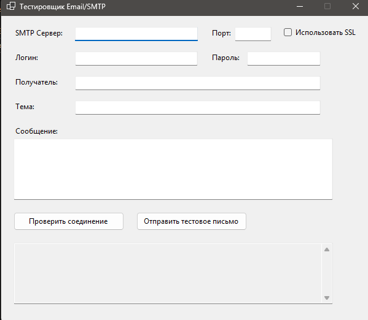

# Email/SMTP Tester (WinForms)
---
- Приложение для проверки работы SMTP серверов и отправки тестовых писем
---
- An application for checking SMTP servers and sending test emails
---
## Описание
- Приложение для проверки подключения к SMTP серверу
- Поддерживает указание:
- Email и пароль
- SMTP сервер
- Порт
- SSL/TLS
- Приложение выводит лог соединения и сообщает об успешной отправке или ошибках
---
## Description
- An application for checking the connection to the SMTP server
- Supports specifying:
- Email and password
- SMTP server
- Port
- SSL/TLS
- The application displays the connection log and reports on successful sending or errors.
---
## О проекте:
- Проверка работы SMTP сервера
- Поддержка разных портов и SSL/TLS
- Лог ошибок и успешных попыток
- Тестовые письма отправляются на указанный email
---
## About the project:
- Checking the SMTP server operation
- Support for different ports and SSL/TLS
- Error log and successful attempts
- Test emails are sent to the specified email address
---
## Настройки SMTP

| Провайдер | SMTP сервер       | Порт | SSL/TLS  |
|-----------|-----------------|------|----------|
| Mail.ru   | smtp.mail.ru     | 465  | SSL      |
| Gmail     | smtp.gmail.com   | 587  | TLS      |
| Yandex    | smtp.yandex.ru  | 465  | SSL      |

---

## SMTP Settings

| Provider | SMTP server | Port | SSL/TLS |
|-----------|-----------------|------|----------|
| Mail.ru   | smtp.mail.ru     | 465  | SSL      |
| Gmail     | smtp.gmail.com   | 587  | TLS      |
| Yandex    | smtp.yandex.ru  | 465  | SSL      |

---

## Скриншот

---